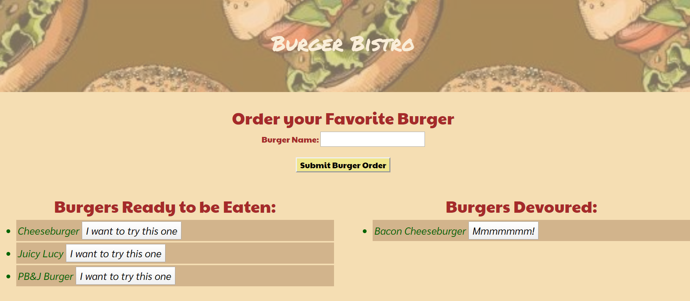

# Burger Bistro 2 - The Sequel(ized)🍔
Burger Bistro 2 is a full-stack application that utilizes MYSQL, Node, Express, Handlebars, and Sequelize.

## Overview: 
Just like its predecessor the original Burger Bistro, Express-Handlebars is utilized to render HTML onto the page, and the MVC model for folder structure. Instead of using a homemade ORM, Sequelized is used instead to store and update the burger data for the client.

## Getting Started:

* For a live demo, please go to the following link: `https://polar-beyond-56526.herokuapp.com/burgers`
* To add burgers to the "Burgers Ready to be Eaten" column, please enter and submit your burger order.
* To eat the burger, click on "I want to try this one" button, and it will move to the "Burgers Devoured" column.

## App Example:
​

## Technologies Used:
-   HTML
-   CSS/Bootstrap
-   Google Fonts
-	Javascript
-   Jquery
-   MYSQL
-	Node.js
-	NPM packages:
    -	Express
    -   Express-Handlebars
    -   MYSQL
    -   MYSQL2
    -   Sequelize
-   Heroku
-   GitHub

#### Go to npmjs if you want to know more about:

1. **Express**:  https://www.npmjs.com/package/express
2. **Express-Handlebars**: https://www.npmjs.com/package/express-handlebars
3. **MYSQL**: https://www.npmjs.com/package/mysql
4. **MYSQL2**: https://www.npmjs.com/package/mysql2
5. **Sequelize**: https://www.npmjs.com/package/sequelize

## Future Enhancements:
Adding the delete button to complete the full CRUD functionality and implementing the challenges around customer association and validation.

## Connect with Me & View my Work:
- <a href="https://arohl2015.github.io/Updated-Portfolio/" target="_blank"> Portfolio <a>
- <a href="https://github.com/arohl2015" target="_blank"> GitHub </a>
- <a href="https://www.linkedin.com/in/aprilrohlcfp/" target="_blank"> LinkedIn </a>
